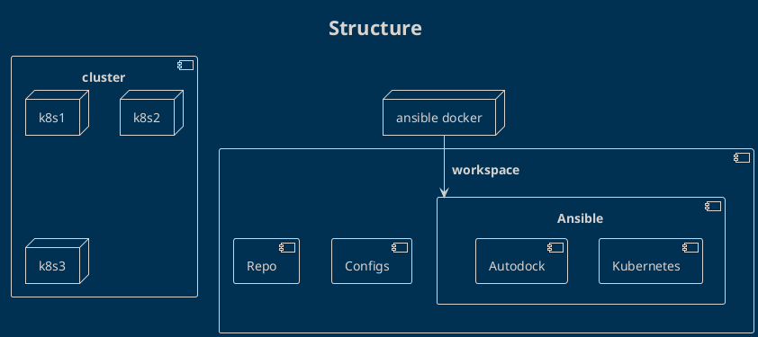

# Auto Dock Ansible

> **NOTICE: Ansible playbooks removed from this repository**
>
> The `iac/ansible/` directory has been removed from `compute-infrastructure` as part of
> the GitOps migration (see `docs/tdd/flux-gitops.md` Phase 4). Bare-metal RKE2
> provisioning is now handled separately via the `hwcopeland/iac` repository
> (github.com/hwcopeland/iac).
>
> The playbooks can be recovered from git history if needed:
> `git log -- iac/ansible/` and `git show <commit>:iac/ansible/<path>`
>
> **Security note:** The file `iac/ansible/inventory/hwc_prox.yaml` contained a
> committed RKE2 join token (`rke2_node_token`). Deleting the directory from the
> working tree does not remove it from git history. A `git filter-repo` history
> rewrite is required for full security remediation. This is flagged in the TDD
> (`docs/tdd/flux-gitops.md` §8.2 open question 4) as an operator decision.
>
> The content below is preserved as historical reference.

---

## Overview

Ansible is a built automation tool that will allow us to configure a kubernetes environment on multiple nodes as well as perform deployments against the kubernetes cluster. Ansible configurations should be versioned in github and include plain plain defaults to get someone up and running with the autodock project.

## Tasks

**General**
- [ ] Ansible:General: Create the outline of the ansible structure.
- [ ] Ansible:Automation: Create a docker image that will allow a user to run ansible commands without having to install ansible on their system.

**Kubernetes**
- [ ] Ansible:Kubernetes: Template each of the kubernetes services in the ias/ansible/templates/kubernetes directory
- [ ] Ansible:Kubernetes: Create an idempotent playbook outline to bootstrap the kubernetes cluster.

**airflow**
- [ ] Ansible:Airflow: Create a playbook to update the ligands.
- [ ] Ansible:Airflow: Create a playbook to bootstrap airflow.

## Ansible

- Docker will run ansible and perform the running of the runbooks.
- Kubernetes deploy playbook will:
  - Install and update host OS and required packages
  - Copy the templated files from the configs directory.
  - Use Kubeadm/Kubectl to setup the pods.
  - Startup pod services.

- Autodock playbook will:
  - Deploy the repo code changes to the given pod.

- This can be extended to support runbooks which we can leverage to grab error logs/reports on the system and it's operations until a better form of metrics/logging can be arranged.